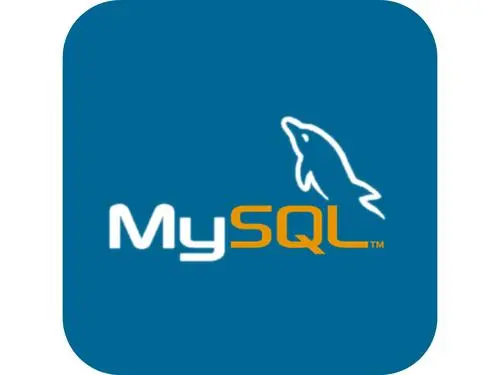

## Java开发工程师—茶哩

热爱后端开发、热爱技术。喜欢并且经常参与一些开源项目的讨论。

### **社交主页：**

 
 
-   <a href="https://space.bilibili.com/433169014"><code></code></a>：B站作者。

### **技术栈:**

<a href="https://v3.cn.vuejs.org"><code></code></a>
<a href="https://mybatis.net.cn/"><code></code></a>
<a href="https://spring.io/"><code></code></a>
<a href="https://www.mysql.com/cn/"><code></code></a>
<a href="https://element.eleme.cn/"><code></code></a>
<a href="https://www.tslang.cn/index.html"><code></code></a>
<a href="https://webpack.js.org/"><code></code></a>
<a href="https://www.docker.com"><code></code></a>

### 开源项目

   

### Github 活跃度

